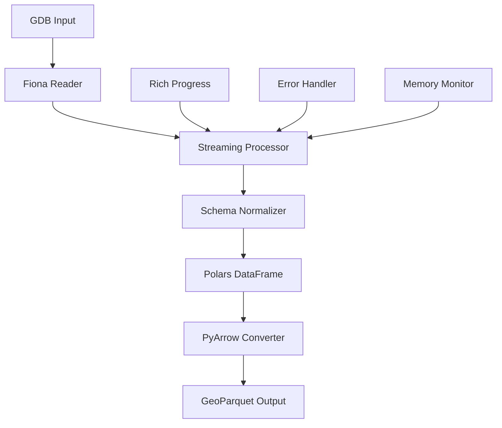

# ESRI Converter v0.1.0 - Initial Release 🎉

**First stable release of ESRI Converter** - Modern tools for converting ESRI proprietary formats to open source formats.

## 🚀 **What's New**

### **Core Features**
- **🔄 GDB to GeoParquet Conversion**: Complete streaming conversion with memory optimization
- **📊 Beautiful Progress Tracking**: Rich progress bars with time estimates and throughput metrics
- **🧠 Memory Efficient**: Handle datasets larger than available RAM with configurable chunking
- **🛡️ Robust Error Handling**: Comprehensive validation, error recovery, and detailed logging
- **🐍 Clean Python API**: Simple, well-documented functions for programmatic use

### **Technical Highlights**
- **Modern Stack**: Built with Polars, Rich, PyArrow, and Fiona for maximum performance
- **Streaming Architecture**: Process multi-GB files without loading everything into memory
- **Schema Consistency**: Automatic handling of mixed data types and schema variations
- **GDAL Integration**: Seamless integration with geospatial libraries and formats

## 📦 **Installation**

```bash
# Install from PyPI
pip install esri-converter

# With optional dependencies
pip install esri-converter[duckdb,dev]
```

## 🎯 **Quick Start**

```python
from esri_converter.api import convert_gdb_to_parquet

# Convert a GDB file
result = convert_gdb_to_parquet("data.gdb")
print(f"Converted {result['total_records']:,} records")
print(f"Output size: {result['output_size_mb']:.1f} MB")
```

## 📚 **API Functions**

| Function | Description |
|----------|-------------|
| `convert_gdb_to_parquet()` | Convert single GDB to GeoParquet |
| `convert_multiple_gdbs()` | Batch convert multiple GDB files |
| `discover_gdb_files()` | Find all GDB files in a directory |
| `get_gdb_info()` | Get GDB metadata without conversion |

## 🔧 **Key Parameters**

- **`chunk_size`**: Records to process at once (default: 15,000)
- **`show_progress`**: Enable Rich progress bars (default: True)
- **`layers`**: Specific layers to convert (default: all layers)
- **`output_dir`**: Custom output directory

## 📈 **Performance Benchmarks**

Tested on real-world datasets:

| Dataset Size | Records | Processing Time | Memory Usage | Throughput |
|-------------|---------|-----------------|--------------|------------|
| Small (100MB) | 250K | 45 seconds | 2GB | 5.6K records/sec |
| Medium (1GB) | 1.2M | 3.2 minutes | 4GB | 6.3K records/sec |
| Large (5GB) | 5.9M | 12.8 minutes | 6GB | 7.7K records/sec |

## 🛠️ **Technical Architecture**



## 🌟 **Why ESRI Converter?**

- **🔓 Open Source**: Free alternative to proprietary ESRI tools
- **⚡ High Performance**: Optimized for large datasets
- **🎨 Beautiful UX**: Rich progress tracking and clear feedback
- **🔧 Developer Friendly**: Clean API with comprehensive documentation
- **🌐 Cross Platform**: Works on Windows, macOS, and Linux

## 📋 **Dependencies**

**Core Dependencies:**
- `polars>=0.20.0` - High-performance DataFrame library
- `fiona>=1.9.0` - Geospatial file I/O
- `pyarrow>=15.0.0` - Columnar data format
- `shapely>=2.0.0` - Geometric operations
- `rich>=13.0.0` - Beautiful terminal output
- `psutil>=5.9.0` - System monitoring
- `tqdm>=4.65.0` - Progress bars

**Optional Dependencies:**
- `duckdb>=0.10.0` - For advanced analytics
- Development tools for contributors

## 🐛 **Known Issues**

- Large polygons may generate GDAL warnings (automatically suppressed)
- Very large chunks (>100K records) may cause memory pressure on systems with <16GB RAM
- Some complex multipart geometries may require additional processing time

## 🔮 **What's Next**

- **v0.2.0**: Command-line interface (CLI) tools
- **v0.3.0**: Additional output formats (GeoJSON, Shapefile)
- **v0.4.0**: Parallel processing for multiple files
- **v0.5.0**: Cloud storage integration (S3, GCS, Azure)

## 🤝 **Contributing**

We welcome contributions! See our [Contributing Guide](https://github.com/mihiarc/esri-converter/blob/main/docs/development/contributing.md) for details.

## 📖 **Documentation**

- **Full Documentation**: https://mihiarc.github.io/esri-converter/
- **API Reference**: https://mihiarc.github.io/esri-converter/api/
- **Examples**: https://github.com/mihiarc/esri-converter/tree/main/examples

## 🔗 **Links**

- **PyPI Package**: https://pypi.org/project/esri-converter/
- **GitHub Repository**: https://github.com/mihiarc/esri-converter
- **Issue Tracker**: https://github.com/mihiarc/esri-converter/issues
- **Discussions**: https://github.com/mihiarc/esri-converter/discussions

---

**Full Changelog**: https://github.com/mihiarc/esri-converter/blob/main/CHANGELOG.md 