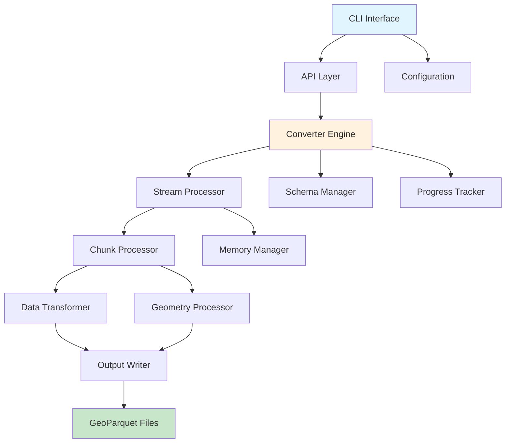
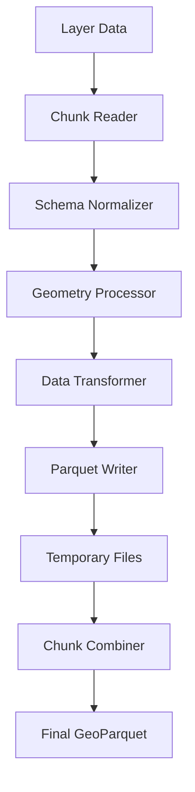
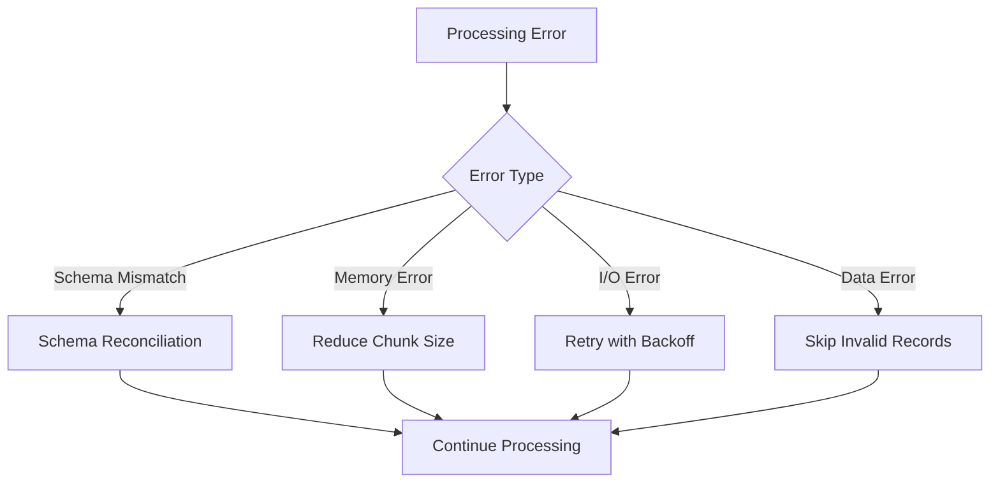

# Architecture

This document describes the technical architecture and design decisions behind ESRI Converter.

## Overview

ESRI Converter is designed as a modular, high-performance system for converting large ESRI Geodatabase files to GeoParquet format. The architecture emphasizes streaming processing, memory efficiency, and robust error handling.

## System Architecture



## Core Components

### 1. API Layer (`esri_converter/api.py`)

The main entry point providing high-level functions:

```python
def convert_gdb_to_parquet(
    gdb_path: str,
    output_path: str,
    chunk_size: int = 15000,
    layers: Optional[List[str]] = None
) -> Dict[str, Any]:
    """Main conversion function with simplified interface."""
```

**Responsibilities:**
- Input validation and sanitization
- Parameter normalization
- Error handling and reporting
- Result aggregation

### 2. Converter Engine (`esri_converter/converters/`)

The core conversion logic with multiple specialized converters:

#### Enhanced GDB Converter
```python
class EnhancedGDBConverter:
    """High-performance streaming GDB converter."""
    
    def convert_gdb_enhanced(
        self,
        gdb_path: str,
        output_dir: str = None,
        chunk_size: int = 15000
    ) -> Dict[str, Any]:
        """Convert GDB with advanced features."""
```

**Key Features:**
- Streaming processing for memory efficiency
- Configurable chunk sizes
- Schema consistency management
- Rich progress tracking
- Robust error recovery

### 3. Stream Processor

Handles large datasets that don't fit in memory:

```python
class StreamProcessor:
    """Process GDB data in streaming fashion."""
    
    def __init__(self, chunk_size: int = 15000):
        self.chunk_size = chunk_size
        self.temp_files = []
    
    def process_layer_streaming(
        self,
        layer_path: str,
        output_path: str
    ) -> Dict[str, Any]:
        """Stream process a single layer."""
```

**Design Principles:**
- **Lazy Loading**: Load only necessary data
- **Bounded Memory**: Configurable memory limits
- **Incremental Processing**: Process data in chunks
- **Temporary Storage**: Efficient intermediate file handling

### 4. Schema Manager

Ensures consistent schemas across chunks:

```python
class SchemaManager:
    """Manage schema consistency across chunks."""
    
    def normalize_schema(
        self,
        chunks: List[Dict[str, Any]]
    ) -> Dict[str, Any]:
        """Normalize schemas across all chunks."""
    
    def infer_unified_schema(
        self,
        sample_chunks: List[Dict[str, Any]]
    ) -> Dict[str, str]:
        """Infer consistent schema from samples."""
```

**Capabilities:**
- **Type Inference**: Smart field type detection
- **Schema Merging**: Combine schemas from multiple chunks
- **Type Coercion**: Convert types for consistency
- **Missing Field Handling**: Add null columns as needed

### 5. Progress Tracker

Rich UI for progress monitoring:

```python
class ProgressTracker:
    """Rich progress tracking with ETA."""
    
    def __init__(self, use_rich: bool = True):
        self.console = Console()
        self.progress = Progress(...)
    
    def track_conversion(
        self,
        total_records: int,
        layer_name: str
    ) -> TaskID:
        """Create progress task for conversion."""
```

**Features:**
- **Real-time Updates**: Live progress bars
- **ETA Calculation**: Time remaining estimates
- **Multi-layer Tracking**: Progress for multiple layers
- **Rich Formatting**: Beautiful terminal output

## Data Flow

### 1. Input Processing


1. **File Validation**: Check GDB accessibility
2. **Layer Discovery**: Enumerate available layers
3. **Metadata Extraction**: Get record counts, field info
4. **Chunk Size Calculation**: Optimize for available memory

### 2. Streaming Conversion



1. **Chunk Reading**: Read configurable record batches
2. **Schema Normalization**: Ensure consistent field types
3. **Geometry Processing**: Convert to WKT format
4. **Data Transformation**: Apply necessary conversions
5. **Temporary Storage**: Write intermediate Parquet files
6. **Chunk Combination**: Merge chunks into final output

### 3. Error Recovery



## Memory Management

### Memory-Bounded Processing

```python
class MemoryManager:
    """Manage memory usage during conversion."""
    
    def __init__(self, max_memory_gb: float = None):
        self.max_memory = max_memory_gb or self._detect_available_memory()
        self.current_usage = 0
    
    def calculate_optimal_chunk_size(
        self,
        record_count: int,
        field_count: int
    ) -> int:
        """Calculate optimal chunk size for memory constraints."""
        
        # Estimate memory per record
        memory_per_record = field_count * 100  # bytes (rough estimate)
        max_records = self.max_memory * 1024**3 / memory_per_record
        
        return min(max_records, 50000)  # Cap at 50k records
```

### Garbage Collection Strategy

- **Explicit Cleanup**: Delete temporary files immediately
- **Memory Monitoring**: Track usage throughout processing
- **Chunk Size Adaptation**: Reduce chunk size if memory pressure detected
- **Lazy Loading**: Load data only when needed

## Error Handling Strategy

### Three-Tier Error Handling

1. **Graceful Degradation**: Continue with reduced functionality
2. **Retry Logic**: Attempt recovery with different parameters
3. **Fail-Safe**: Clean shutdown with detailed error reporting

```python
class ErrorHandler:
    """Comprehensive error handling."""
    
    def handle_conversion_error(
        self,
        error: Exception,
        context: Dict[str, Any]
    ) -> ErrorAction:
        """Determine appropriate error response."""
        
        if isinstance(error, MemoryError):
            return ErrorAction.REDUCE_CHUNK_SIZE
        elif isinstance(error, SchemaError):
            return ErrorAction.NORMALIZE_SCHEMA
        elif isinstance(error, IOError):
            return ErrorAction.RETRY_WITH_BACKOFF
        else:
            return ErrorAction.FAIL_WITH_REPORT
```

## Performance Optimizations

### 1. Chunked Processing

- **Configurable Chunks**: Adapt to available memory
- **Parallel Chunks**: Process multiple chunks concurrently
- **Streaming I/O**: Minimize memory footprint

### 2. Schema Optimization

- **Schema Caching**: Reuse inferred schemas
- **Type Coercion**: Minimize type conversions
- **Column Pruning**: Process only necessary fields

### 3. I/O Optimization

- **Buffered Writes**: Batch output operations
- **Compression**: Use efficient Parquet compression
- **Temporary Storage**: Optimize intermediate file handling

## Extensibility

### Plugin Architecture

```python
class ConverterPlugin:
    """Base class for converter plugins."""
    
    def can_handle(self, input_format: str) -> bool:
        """Check if plugin can handle input format."""
        pass
    
    def convert(
        self,
        input_path: str,
        output_path: str,
        **kwargs
    ) -> Dict[str, Any]:
        """Perform conversion."""
        pass
```

### Custom Processors

```python
class GeometryProcessor:
    """Pluggable geometry processing."""
    
    def process_geometry(
        self,
        geometry: Any,
        source_crs: str,
        target_crs: str = "EPSG:4326"
    ) -> str:
        """Process and transform geometry."""
        pass
```

## Configuration Management

### Hierarchical Configuration

1. **Default Values**: Built-in sensible defaults
2. **Environment Variables**: System-level overrides
3. **Configuration Files**: Project-specific settings
4. **Command Line Arguments**: Runtime overrides
5. **API Parameters**: Programmatic control

```python
class ConfigManager:
    """Manage configuration hierarchy."""
    
    def get_config(self, key: str) -> Any:
        """Get configuration value with precedence."""
        # Check CLI args -> config file -> env vars -> defaults
        pass
```

## Testing Architecture

### Test Categories

1. **Unit Tests**: Individual component testing
2. **Integration Tests**: Component interaction testing
3. **Performance Tests**: Benchmarking and profiling
4. **End-to-End Tests**: Full workflow validation

### Test Data Management

```python
class TestDataManager:
    """Manage test datasets."""
    
    def create_sample_gdb(
        self,
        record_count: int,
        field_count: int,
        geometry_type: str = "Point"
    ) -> str:
        """Create synthetic GDB for testing."""
        pass
```

## Monitoring and Observability

### Metrics Collection

- **Performance Metrics**: Processing speed, memory usage
- **Error Metrics**: Failure rates, error types
- **Usage Metrics**: Feature usage, file sizes

### Logging Strategy

```python
import logging

logger = logging.getLogger(__name__)

# Structured logging with context
logger.info(
    "Conversion started",
    extra={
        'gdb_path': gdb_path,
        'chunk_size': chunk_size,
        'total_records': total_records
    }
)
```

## Future Architecture Considerations

### Scalability Enhancements

1. **Distributed Processing**: Multi-machine processing
2. **Cloud Integration**: Native cloud storage support
3. **Streaming Protocols**: Real-time data processing
4. **GPU Acceleration**: Leverage GPU for geometry processing

### API Evolution

1. **GraphQL API**: More flexible querying
2. **Streaming API**: Real-time conversion status
3. **Webhook Support**: Event-driven notifications
4. **Plugin Marketplace**: Community-contributed processors

This architecture provides a solid foundation for high-performance, scalable GDB conversion while maintaining flexibility for future enhancements. 