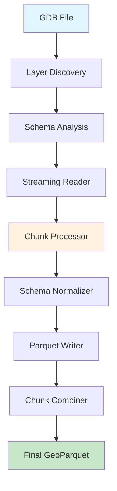

# ESRI Converter

<div align="center">
  <h2>🗺️ Modern Python Package for GDB to GeoParquet Conversion</h2>
  <p><em>High-performance, streaming conversion of ESRI Geodatabase files to GeoParquet format</em></p>
</div>

---

## Overview

**ESRI Converter** is a cutting-edge Python package designed to efficiently convert large ESRI Geodatabase (GDB) files to the modern GeoParquet format. Built with performance and scalability in mind, it handles multi-gigabyte datasets with ease using streaming processing and modern data libraries.

## ✨ Key Features

- **🚀 High Performance**: Streaming processing with configurable chunk sizes
- **📊 Rich Progress Tracking**: Beautiful progress bars and real-time statistics
- **🔄 Batch Processing**: Convert multiple GDB files simultaneously  
- **🛡️ Robust Error Handling**: Comprehensive error recovery and fallback mechanisms
- **🎯 Schema Consistency**: Automatic schema normalization across chunks
- **⚡ Modern Stack**: Built on Polars, DuckDB, and Rich for maximum performance

## 🎯 Use Cases

- **Large-Scale Data Migration**: Convert enterprise GDB files to cloud-native formats
- **Data Pipeline Integration**: Seamlessly integrate with modern geospatial workflows
- **Performance Optimization**: Reduce file sizes and improve query performance
- **Cross-Platform Compatibility**: Work with GeoParquet across different tools and platforms

## 🚀 Quick Start

```bash
# Install the package
pip install esri-converter

# Convert a single GDB file
esri-converter convert input.gdb output.parquet

# Batch convert with custom chunk size
esri-converter batch-convert *.gdb --chunk-size 25000 --output-dir ./converted/
```

## 📈 Performance Highlights

- **Streaming Processing**: Handle datasets larger than available memory
- **Parallel Processing**: Multi-threaded chunk processing for maximum throughput
- **Optimized I/O**: Efficient reading and writing with minimal memory footprint
- **Smart Chunking**: Adaptive chunk sizes based on data characteristics

## 🏗️ Architecture



## 🌟 Why Choose ESRI Converter?

| Feature | Traditional Tools | ESRI Converter |
|---------|-------------------|----------------|
| **Memory Usage** | Loads entire dataset | Streaming processing |
| **Performance** | Single-threaded | Multi-threaded chunks |
| **Progress Tracking** | Basic or none | Rich UI with ETA |
| **Error Handling** | Fails on errors | Robust recovery |
| **Schema Issues** | Manual fixes needed | Automatic normalization |
| **Batch Processing** | Manual scripting | Built-in batch support |

## 📚 Documentation

- [**Installation Guide**](getting-started/installation.md) - Get up and running quickly
- [**Quick Start Tutorial**](getting-started/quickstart.md) - Your first conversion in 5 minutes
- [**User Guide**](user-guide/converting.md) - Complete conversion workflows
- [**API Reference**](reference/) - Detailed API documentation
- [**Performance Tips**](user-guide/performance.md) - Optimize for your use case

## 🤝 Community & Support

- **GitHub**: [mihiarc/esri-converter](https://github.com/mihiarc/esri-converter)
- **Issues**: Report bugs and request features
- **Discussions**: Share experiences and get help

## 📄 License

This project is licensed under the MIT License - see the [LICENSE](https://github.com/mihiarc/esri-converter/blob/main/LICENSE) file for details.

---

<div align="center">
  <p><strong>Ready to modernize your geospatial data workflows?</strong></p>
  <p><a href="getting-started/installation/">Get Started →</a></p>
</div> 